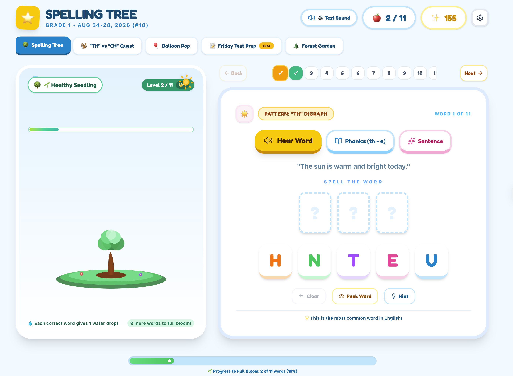

# Spelling Tree Garden

## Why I built this

My kid's school homework is dry, and it's not easy to keep him focused on the content. Learning shouldn't feel like a chore — but drilling spelling words often does. It's a pain for parents too, having to push him to memorize word after word.

I wanted to use a game to help him understand how phonics actually work in the words he's learning each week.

## Try it

👉 [wordswordswords-kappa.vercel.app](https://wordswordswords-kappa.vercel.app/)

## What it does

- Hear words with tricky letter combos like "th" and "ch"
- See those words used in real sentences, so kids learn how to use them, not just spell them
- Spell a word correctly and watch a little tree grow — kids love watching it turn into an apple tree. It makes them feel proud of their progress.
